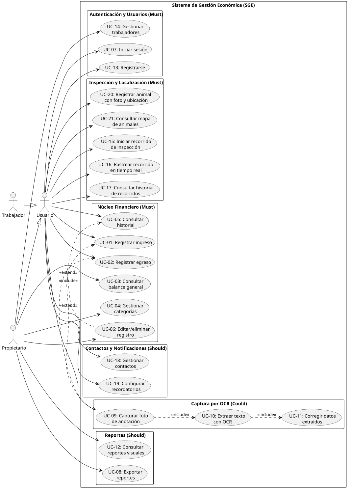
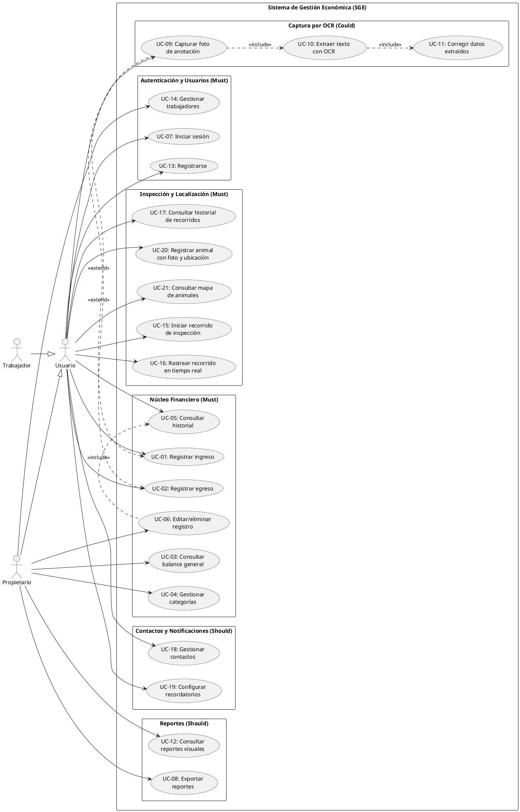

# Casos de Uso
### Sistema de Gestión Económica — Finca Ganadera
*Versión 3 · 11 de agosto de 2026 — GPS: inspecciones + animales geolocalizados; OCR on-device; Nominatim; UC-20/UC-21*

---

## Diagrama de Casos de Uso

Fuente PlantUML

> **Regenerar el SVG:** tras editar el bloque PlantUML, ejecuta `scripts/render-diagrams.sh` y commitea los cambios de `assets/`. El CI falla si el SVG commiteado no corresponde a la fuente.

### Actores

| Actor | Tipo | Descripción |
|---|---|---|
| **Usuario** | Generalización | Actor abstracto que agrupa la funcionalidad común a ambos roles. No se instancia directamente. |
| **Propietario** | Primario (hereda de Usuario) | Dueño o administrador de la finca. Tiene acceso completo: finanzas, reportes, gestión de trabajadores y categorías. |
| **Trabajador** | Primario (hereda de Usuario) | Empleado de campo. Puede registrar transacciones, consultar historial, rastrear recorridos, registrar animales, gestionar contactos y configurar recordatorios. No accede a balance general, reportes, ni gestión de categorías/trabajadores. |

> **Nota:** ya no hay actor secundario "API IA Multimodal". La extracción de texto se hace con OCR on-device (ML Kit), sin actor externo. La API REST externa (Nominatim para geocoding) es invocada directamente por el sistema, no representa un actor en el diagrama.

### Relaciones clave

| Relación | Tipo | Justificación |
|---|---|---|
| Propietario / Trabajador → Usuario | Generalización | Ambos roles comparten la funcionalidad base (registro, historial, inspección, contactos). La generalización evita duplicar asociaciones. |
| UC-06 → UC-05 | `<<include>>` | Para editar o eliminar, el usuario primero consulta el historial para localizar el registro |
| UC-09 → UC-10 → UC-11 | `<<include>>` | Cadena obligatoria: capturar foto siempre desencadena extracción OCR, y la extracción siempre pasa por corrección humana |
| UC-09 → UC-01 / UC-02 | `<<extend>>` | La captura por foto es una vía alternativa (opcional) de registrar una transacción |

---

## Especificaciones de Casos de Uso

### UC-01 — Registrar ingreso

| Campo | Detalle |
|---|---|
| **ID** | UC-01 |
| **HU origen** | HU-01 (RF-01 · Must) |
| **Actor principal** | Usuario (Propietario o Trabajador) |
| **Precondición** | El usuario está autenticado (UC-07) |
| **Postcondición** | El ingreso queda persistido y sincronizado; el balance se actualiza |

**Flujo principal:**
1. El usuario selecciona "Registrar ingreso" desde la pantalla principal.
2. El sistema muestra el formulario con: fecha (predeterminada: hoy), categoría de ingreso (lista de categorías activas), monto, nota (opcional), medio de pago (opcional).
3. El usuario completa al menos fecha, categoría y monto.
4. El usuario confirma el registro.
5. El sistema valida los campos obligatorios.
6. El sistema persiste el ingreso localmente y lo sincroniza con Firestore.
7. El sistema muestra confirmación y regresa a la pantalla principal.

**Flujos alternativos:**
- **3a.** El usuario usa los valores predeterminados (fecha = hoy) → salta al paso 4.
- **5a.** Monto vacío o inválido → el sistema muestra error y permanece en el formulario.
- **6a.** Sin conexión → el registro se persiste localmente (Room) y se sincroniza cuando se recupere la conexión.
- **1a.** El usuario agita el dispositivo (shake) → el sistema abre directamente el formulario de registro rápido (sensor: acelerómetro).

---

### UC-02 — Registrar egreso

| Campo | Detalle |
|---|---|
| **ID** | UC-02 |
| **HU origen** | HU-02 (RF-02 · Must) |
| **Actor principal** | Usuario (Propietario o Trabajador) |
| **Precondición** | El usuario está autenticado (UC-07) |
| **Postcondición** | El egreso queda persistido y sincronizado; el balance se actualiza |

**Flujo principal:**
1. El usuario selecciona "Registrar egreso" desde la pantalla principal.
2. El sistema muestra el formulario con: fecha (predeterminada: hoy), categoría de egreso (lista de categorías activas), monto, nota (opcional), medio de pago (opcional).
3. El usuario completa al menos fecha, categoría y monto.
4. El usuario confirma el registro.
5. El sistema valida los campos obligatorios.
6. El sistema persiste el egreso localmente y lo sincroniza con Firestore.
7. El sistema muestra confirmación y regresa a la pantalla principal.

**Flujos alternativos:**
- Idénticos a UC-01 (3a, 5a, 6a, 1a) pero aplicados a egresos.

---

### UC-03 — Consultar balance general

| Campo | Detalle |
|---|---|
| **ID** | UC-03 |
| **HU origen** | HU-03 (RF-03 · Must) |
| **Actor principal** | Propietario |
| **Precondición** | El propietario está autenticado (UC-07) |
| **Postcondición** | El balance se muestra en pantalla (solo lectura) |

**Flujo principal:**
1. El propietario abre la pantalla de balance.
2. El sistema calcula y muestra: total de ingresos, total de egresos y balance neto del mes en curso.
3. El propietario puede seleccionar comparación (mes vs. mes anterior, año vs. año anterior).
4. El sistema muestra ambos periodos lado a lado con la variación.

**Flujos alternativos:**
- **2a.** No hay transacciones en el periodo → el sistema muestra balance en cero.
- **3a.** El propietario selecciona "desglose por actividad" → el sistema muestra subtotales por actividad (Lechería, Ganado, General).

---

### UC-04 — Gestionar categorías

| Campo | Detalle |
|---|---|
| **ID** | UC-04 |
| **HU origen** | HU-04 (RF-04 · Must) |
| **Actor principal** | Propietario |
| **Precondición** | El propietario está autenticado (UC-07) |
| **Postcondición** | La categoría reservada queda activa (o inactiva) y disponible (o no) en los formularios de registro |

**Flujo principal:**
1. El propietario accede a la configuración de categorías.
2. El sistema muestra las categorías agrupadas por tipo (ingreso/egreso) y actividad, diferenciando activas de reservadas inactivas.
3. El propietario selecciona una categoría reservada y la activa.
4. El sistema confirma la activación.

**Flujos alternativos:**
- **3a.** El propietario desactiva una categoría reservada previamente activada → la categoría deja de aparecer en los formularios de registro.

**Nota:** Las categorías base (no reservadas) están siempre activas y no se pueden desactivar ni crear nuevas. La lista está cerrada con el cliente (ver sección 8 del documento de requisitos).

---

### UC-05 — Consultar historial de transacciones

| Campo | Detalle |
|---|---|
| **ID** | UC-05 |
| **HU origen** | HU-05 (RF-05 · Must) |
| **Actor principal** | Usuario (Propietario o Trabajador) |
| **Precondición** | El usuario está autenticado (UC-07) |
| **Postcondición** | Se muestra la lista de transacciones filtrada (solo lectura) |

**Flujo principal:**
1. El usuario abre la pantalla de historial.
2. El sistema muestra las transacciones del mes en curso, ordenadas de más reciente a más antigua, con fecha, categoría, tipo y monto.
3. El usuario aplica filtros: rango de fechas, categoría y/o actividad.
4. El sistema actualiza la lista mostrando solo las transacciones que cumplen los criterios.

**Flujos alternativos:**
- **4a.** Ningún resultado coincide con los filtros → el sistema muestra mensaje "No hay transacciones para los filtros seleccionados".

**Nota:** El trabajador ve todas las transacciones de la finca (no solo las propias) para transparencia, pero no puede editarlas ni eliminarlas (ver UC-06).

---

### UC-06 — Editar o eliminar registro

| Campo | Detalle |
|---|---|
| **ID** | UC-06 |
| **HU origen** | HU-06 (RF-06 · Must) |
| **Actor principal** | Propietario |
| **Precondición** | El propietario localizó la transacción en el historial (UC-05) |
| **Postcondición** | La transacción queda actualizada o eliminada y el balance se recalcula |

**Flujo principal (edición):**
1. El propietario selecciona una transacción del historial.
2. El propietario elige "Editar".
3. El sistema abre el formulario con los datos precargados.
4. El propietario modifica los campos deseados.
5. El propietario confirma la edición.
6. El sistema valida y persiste los cambios.
7. El sistema recalcula el balance y muestra confirmación.

**Flujo alternativo (eliminación):**
- **2a.** El propietario elige "Eliminar".
- **2b.** El sistema muestra diálogo de confirmación.
- **2c.** El propietario confirma → la transacción se elimina, el balance se recalcula.
- **2d.** El propietario cancela → no se modifica nada.

---

### UC-07 — Iniciar sesión

| Campo | Detalle |
|---|---|
| **ID** | UC-07 |
| **HU origen** | HU-07 (RF-07 · Must) |
| **Actor principal** | Usuario (Propietario o Trabajador) |
| **Precondición** | La app está instalada y el usuario tiene una cuenta registrada (UC-13) |
| **Postcondición** | El usuario tiene una sesión activa asociada a su finca |

**Flujo principal:**
1. El usuario abre la aplicación.
2. El sistema muestra la pantalla de inicio de sesión.
3. El usuario ingresa email y contraseña.
4. El sistema valida las credenciales con Firebase Auth.
5. El sistema carga los datos de la finca asociada y redirige a la pantalla principal.

**Flujos alternativos:**
- **1a.** Sesión previa activa (token válido) → el sistema salta al paso 5 directamente.
- **4a.** Credenciales incorrectas → el sistema muestra "Credenciales incorrectas" y permanece en la pantalla de login.
- **4b.** Sin conexión → el sistema permite acceso con datos locales en caché (modo offline). Las escrituras se sincronizarán al recuperar conexión.
- **Cerrar sesión:** desde cualquier pantalla, el usuario selecciona "Cerrar sesión" → el sistema cierra la sesión y vuelve al paso 2.

---

### UC-08 — Exportar reportes

| Campo | Detalle |
|---|---|
| **ID** | UC-08 |
| **HU origen** | HU-08 (RF-08 · Should) |
| **Actor principal** | Propietario |
| **Precondición** | El propietario está autenticado y tiene un balance o historial visible |
| **Postcondición** | Se genera un archivo PDF o Excel y se ofrece compartirlo o guardarlo |

**Flujo principal:**
1. Desde la pantalla de balance o historial, el propietario selecciona "Exportar".
2. El sistema pregunta el formato: PDF o Excel.
3. El propietario elige un formato.
4. El sistema genera el archivo con los datos del periodo/filtro activo.
5. El sistema ofrece compartir (vía Android share sheet) o guardar en el dispositivo.

**Flujos alternativos:**
- **4a.** No hay datos para el periodo/filtro → el sistema muestra mensaje "No hay datos para exportar".

---

### UC-09 — Capturar foto de anotación

| Campo | Detalle |
|---|---|
| **ID** | UC-09 |
| **HU origen** | HU-09 (RF-09 · Could) |
| **Actor principal** | Usuario (Propietario o Trabajador) |
| **Precondición** | El usuario está autenticado; el dispositivo tiene cámara |
| **Postcondición** | Se captura una imagen que se pasa a UC-10 para extracción |

**Flujo principal:**
1. El usuario selecciona "Registrar desde foto".
2. El sistema abre la cámara del dispositivo.
3. El usuario toma la foto de la anotación manuscrita.
4. El sistema muestra vista previa con opciones "Usar foto" y "Volver a tomar".
5. El usuario selecciona "Usar foto".
6. El sistema pasa la imagen a UC-10.

**Flujos alternativos:**
- **2a.** El usuario selecciona una imagen existente de la galería en vez de tomar foto nueva.
- **5a.** El usuario selecciona "Volver a tomar" → vuelve al paso 2.

---

### UC-10 — Extraer texto con OCR

| Campo | Detalle |
|---|---|
| **ID** | UC-10 |
| **HU origen** | HU-10 (RF-10 · Could) |
| **Actor principal** | Usuario (Propietario o Trabajador) |
| **Precondición** | Se capturó una foto (UC-09) |
| **Postcondición** | Los campos del formulario de registro están prellenados con los datos extraídos |

**Flujo principal:**
1. El sistema procesa la imagen con OCR on-device (Google ML Kit Text Recognition).
2. El sistema muestra un indicador de carga breve (procesamiento local, sin latencia de red).
3. El OCR devuelve el texto reconocido.
4. El sistema intenta extraer fecha, concepto/categoría y monto del texto.
5. El sistema prellena el formulario de registro con los datos extraídos.
6. El sistema pasa el control a UC-11 para corrección humana.

**Flujos alternativos:**
- **3a.** El OCR no puede reconocer texto legible → el sistema informa al usuario y ofrece volver a tomar la foto o registrar manualmente.
- **4a.** El texto se reconoce pero no se pueden extraer campos estructurados → el sistema muestra el texto crudo y el usuario completa los campos manualmente.

**Restricción técnica:** Se usa OCR on-device (Google ML Kit), gratuito y sin conexión (decisión D6). No se usa API multimodal — sin presupuesto para tokens.

---

### UC-11 — Corregir datos extraídos

| Campo | Detalle |
|---|---|
| **ID** | UC-11 |
| **HU origen** | HU-11 (RF-11 · Could) |
| **Actor principal** | Usuario (Propietario o Trabajador) |
| **Precondición** | UC-10 prellenó el formulario con datos extraídos |
| **Postcondición** | La transacción se guarda con los datos corregidos (o tal cual si no hubo correcciones) |

**Flujo principal:**
1. El sistema muestra el formulario prellenado con la foto original como referencia.
2. El usuario revisa los datos.
3. Si hay errores, el usuario corrige los campos necesarios.
4. El usuario confirma el registro.
5. El sistema aplica las mismas validaciones que UC-01/UC-02 y persiste la transacción.

**Flujos alternativos:**
- **2a.** El usuario no está conforme → selecciona "Descartar" → se limpian los campos y puede registrar manualmente.

---

### UC-12 — Consultar reportes visuales

| Campo | Detalle |
|---|---|
| **ID** | UC-12 |
| **HU origen** | HU-12 (RF-12 · Could) |
| **Actor principal** | Propietario |
| **Precondición** | El propietario está autenticado |
| **Postcondición** | Se muestran gráficos en pantalla (solo lectura) |

**Flujo principal:**
1. El propietario abre la sección de reportes visuales.
2. El sistema muestra un gráfico de barras de ingresos vs. egresos mensual.
3. El propietario puede cambiar la vista a "por actividad".
4. El sistema muestra un gráfico con la proporción de cada actividad.

**Flujos alternativos:**
- **2a.** No hay datos suficientes para el periodo → el sistema muestra mensaje indicándolo.

---

### UC-13 — Registrarse

| Campo | Detalle |
|---|---|
| **ID** | UC-13 |
| **Prioridad** | Must |
| **Actor principal** | Usuario (nuevo) |
| **Precondición** | La app está instalada; el usuario no tiene cuenta |
| **Postcondición** | Se crea una cuenta en Firebase Auth y se asocia a una finca (nueva o existente) |

**Flujo principal:**
1. El usuario selecciona "Crear cuenta" desde la pantalla de login.
2. El sistema muestra formulario de registro: nombre, email, contraseña.
3. El usuario completa los campos y confirma.
4. El sistema crea la cuenta en Firebase Auth.
5. El sistema pregunta: "¿Crear una finca nueva?" o "¿Unirse a una finca existente?" (mediante código de invitación).
6. **Crear finca:** el sistema pide nombre y ubicación de la finca → crea la finca en Firestore → asigna rol Propietario.
7. El sistema redirige a la pantalla principal.

**Flujos alternativos:**
- **3a.** Email ya registrado → el sistema muestra error y sugiere iniciar sesión.
- **3b.** Contraseña débil → el sistema muestra los requisitos mínimos.
- **5a.** "Unirse a finca existente" → el usuario ingresa código de invitación → el sistema valida → asigna rol Trabajador → paso 7.
- **5b.** Código de invitación inválido → el sistema muestra error.

---

### UC-14 — Gestionar trabajadores

| Campo | Detalle |
|---|---|
| **ID** | UC-14 |
| **Prioridad** | Must |
| **Actor principal** | Propietario |
| **Precondición** | El propietario está autenticado y es dueño de una finca |
| **Postcondición** | Se genera/revoca un código de invitación, o se desactiva un trabajador |

**Flujo principal:**
1. El propietario accede a "Gestionar equipo" en configuración.
2. El sistema muestra la lista de trabajadores actuales con su estado (activo/inactivo).
3. El propietario selecciona "Invitar trabajador".
4. El sistema genera un código de invitación con expiración (24h).
5. El propietario comparte el código con el trabajador (vía Android share sheet, WhatsApp, etc.).

**Flujos alternativos:**
- **3a.** El propietario selecciona un trabajador existente → puede desactivarlo (revoca acceso a la finca) o reactivarlo.
- **4a.** Ya hay un código activo → el sistema pregunta si desea generar uno nuevo (invalida el anterior).

---

### UC-15 — Iniciar recorrido de inspección

| Campo | Detalle |
|---|---|
| **ID** | UC-15 |
| **Prioridad** | Must |
| **Actor principal** | Usuario (Propietario o Trabajador) |
| **Precondición** | El usuario está autenticado; el dispositivo tiene GPS habilitado |
| **Postcondición** | Se crea un registro de recorrido con los puntos GPS capturados |

**Flujo principal:**
1. El usuario selecciona "Nuevo recorrido de inspección".
2. El sistema solicita permisos de ubicación (si no se han concedido).
3. El sistema muestra el mapa con la posición actual y un botón "Iniciar recorrido".
4. El usuario inicia el recorrido.
5. El sistema comienza a registrar puntos GPS periódicamente (→ UC-16).
6. Durante el recorrido, el usuario puede registrar animales con foto y ubicación (→ UC-20).
7. El usuario selecciona "Finalizar recorrido" al completar la inspección.
8. El sistema calcula la distancia total y guarda el recorrido.
9. El sistema muestra un resumen (distancia, duración, mapa del recorrido, animales registrados).

**Flujos alternativos:**
- **2a.** El usuario deniega permisos de ubicación → el sistema informa que la funcionalidad requiere GPS y regresa.
- **7a.** La app se cierra inesperadamente → al reabrirse, ofrece retomar el recorrido activo o descartarlo.
- **Sensor proximidad:** durante el tracking (pasos 5-7), si el sensor de proximidad detecta que el teléfono está en bolsillo, el sistema mantiene el GPS activo pero apaga la pantalla para ahorrar batería.

---

### UC-16 — Rastrear recorrido en tiempo real

| Campo | Detalle |
|---|---|
| **ID** | UC-16 |
| **Prioridad** | Must |
| **Actor principal** | Usuario (Propietario o Trabajador) |
| **Precondición** | Hay un recorrido activo (UC-15 en progreso) |
| **Postcondición** | La posición se actualiza en tiempo real sobre el mapa |

**Flujo principal:**
1. Mientras el recorrido está activo, el sistema muestra el mapa con la posición actual del usuario.
2. El mapa se actualiza en tiempo real conforme el usuario se desplaza.
3. Se dibujan los puntos GPS registrados como una línea sobre el mapa.
4. El sistema muestra métricas en vivo: distancia acumulada, tiempo transcurrido.
5. Los animales registrados durante el recorrido (UC-20) aparecen como pins en el mapa.

**Flujos alternativos:**
- **1a.** El propietario abre la app y consulta el recorrido activo de un trabajador → ve la posición del trabajador en tiempo real en el mapa (requiere conexión).
- **2a.** Se pierde la señal GPS → el sistema muestra indicador "Sin señal GPS" y retoma el tracking al recuperarla.

---

### UC-17 — Consultar historial de recorridos

| Campo | Detalle |
|---|---|
| **ID** | UC-17 |
| **Prioridad** | Should |
| **Actor principal** | Usuario (Propietario o Trabajador) |
| **Precondición** | El usuario está autenticado; existen recorridos registrados |
| **Postcondición** | Se muestra la lista de recorridos y/o el detalle de uno seleccionado |

**Flujo principal:**
1. El usuario abre la sección "Historial de recorridos".
2. El sistema muestra los recorridos ordenados por fecha (más reciente primero), con fecha, distancia y duración.
3. El usuario selecciona un recorrido.
4. El sistema muestra el trazado completo sobre el mapa con los puntos GPS y los animales registrados durante ese recorrido.

**Flujos alternativos:**
- **2a.** No hay recorridos registrados → el sistema muestra mensaje "No hay recorridos registrados".
- **2b.** El usuario filtra por rango de fechas → el sistema actualiza la lista.

---

### UC-20 — Registrar animal con foto y ubicación

| Campo | Detalle |
|---|---|
| **ID** | UC-20 |
| **Prioridad** | Must |
| **Actor principal** | Usuario (Propietario o Trabajador) |
| **Precondición** | El usuario está autenticado; el dispositivo tiene cámara y GPS |
| **Postcondición** | Se crea un registro de animal con foto, datos y ubicación GPS almacenados |

**Flujo principal:**
1. El usuario selecciona "Registrar animal" (desde la pantalla principal o durante un recorrido de inspección).
2. El sistema abre la cámara del dispositivo.
3. El usuario toma la foto del animal.
4. El sistema captura automáticamente las coordenadas GPS actuales.
5. El sistema invoca la API Nominatim para obtener el nombre del lugar a partir de las coordenadas (geocoding inverso).
6. El sistema muestra formulario: nombre/identificador del animal, notas (opcional), ubicación (autocompletada con nombre del lugar).
7. El usuario completa y confirma.
8. El sistema persiste el registro localmente y lo sincroniza con Firestore.

**Flujos alternativos:**
- **2a.** El usuario selecciona una foto existente de la galería en vez de tomar una nueva.
- **5a.** Sin conexión → el geocoding se omite; se guardan solo las coordenadas. El nombre del lugar se resuelve cuando haya conexión.
- **4a.** GPS no disponible → el sistema permite registrar sin ubicación, con advertencia.

---

### UC-21 — Consultar mapa de animales

| Campo | Detalle |
|---|---|
| **ID** | UC-21 |
| **Prioridad** | Must |
| **Actor principal** | Usuario (Propietario o Trabajador) |
| **Precondición** | El usuario está autenticado; existen animales registrados con ubicación |
| **Postcondición** | Se muestra el mapa con los pins de animales registrados |

**Flujo principal:**
1. El usuario abre la sección "Mapa de animales".
2. El sistema muestra Google Maps centrado en la ubicación de la finca.
3. Los animales registrados aparecen como pins en sus últimas ubicaciones conocidas.
4. El usuario toca un pin → el sistema muestra miniatura de la foto, nombre, fecha y notas.
5. El usuario puede tocar "Ver detalle" → se abre la ficha completa del animal.

**Flujos alternativos:**
- **3a.** No hay animales registrados → el sistema muestra el mapa vacío con mensaje "No hay animales registrados. Usa 'Registrar animal' para agregar uno."
- **3b.** El usuario filtra por fecha o nombre → el sistema actualiza los pins visibles.

---

### UC-18 — Gestionar contactos

| Campo | Detalle |
|---|---|
| **ID** | UC-18 |
| **Prioridad** | Should |
| **Actor principal** | Usuario (Propietario o Trabajador) |
| **Precondición** | El usuario está autenticado |
| **Postcondición** | El contacto queda registrado/actualizado/eliminado en el directorio de la finca |

**Flujo principal:**
1. El usuario accede al directorio de contactos de la finca.
2. El sistema muestra los contactos agrupados por tipo (Proveedor, Veterinario, Comprador, Otro).
3. El usuario selecciona "Agregar contacto".
4. El sistema ofrece: "Crear manualmente" o "Importar del dispositivo".
5. **Importar del dispositivo:** el sistema accede a los contactos del teléfono → el usuario selecciona uno → los datos se copian al formulario.
6. El usuario asigna un tipo de contacto y confirma.
7. El sistema persiste el contacto asociado a la finca.

**Flujos alternativos:**
- **4a.** "Crear manualmente" → el usuario llena nombre, teléfono, email, tipo → paso 7.
- **3a.** El usuario selecciona un contacto existente → puede editarlo o eliminarlo.
- **5a.** El usuario deniega permisos de contactos → solo puede crear manualmente.

---

### UC-19 — Configurar recordatorios

| Campo | Detalle |
|---|---|
| **ID** | UC-19 |
| **Prioridad** | Should |
| **Actor principal** | Usuario (Propietario o Trabajador) |
| **Precondición** | El usuario está autenticado |
| **Postcondición** | Se programa una notificación local (y opcionalmente push) para la fecha/hora indicada |

**Flujo principal:**
1. El usuario accede a "Recordatorios" desde el menú.
2. El sistema muestra los recordatorios activos y pasados.
3. El usuario selecciona "Nuevo recordatorio".
4. El sistema muestra formulario: título, descripción (opcional), fecha/hora, repetición (una vez, diaria, semanal, mensual).
5. El usuario completa y confirma.
6. El sistema programa la notificación local y sincroniza con Firestore.

**Flujos alternativos:**
- **3a.** El usuario selecciona un recordatorio existente → puede editarlo, eliminarlo o marcarlo como completado.
- **Propietario → notificaciones push:** cuando un trabajador registra una transacción, el propietario recibe una notificación push vía Firebase Cloud Messaging.

---

## Integración de sensores (transversal)

Los sensores del dispositivo no son casos de uso independientes; se integran como comportamientos dentro de UCs existentes:

| Sensor | Integración | UCs afectados |
|---|---|---|
| **Acelerómetro** | Gesto de agitación (shake) para abrir el formulario de registro rápido de transacción | UC-01, UC-02 (flujo alternativo 1a) |
| **Proximidad** | Auto-pausa de pantalla cuando el teléfono está en bolsillo durante tracking GPS activo; mantiene GPS y registro de puntos | UC-15, UC-16 (comportamiento del sistema) |

### API REST externa — Nominatim (geocoding inverso)

La API REST externa del curso es **Nominatim (OpenStreetMap)**. Se invoca en UC-20 para convertir coordenadas GPS a nombres de lugar legibles (ej: lat/lng → "Vereda San Juan, Municipio de Chía"). No es un actor en el diagrama porque es una llamada técnica del sistema, no una interacción de negocio.

---

## Trazabilidad HU → UC

| HU | UC | Prioridad | Rol |
|---|---|---|---|
| HU-01 | UC-01 | Must | Usuario |
| HU-02 | UC-02 | Must | Usuario |
| HU-03 | UC-03 | Must | Propietario |
| HU-04 | UC-04 | Must | Propietario |
| HU-05 | UC-05 | Must | Usuario |
| HU-06 | UC-06 | Must | Propietario |
| HU-07 | UC-07 | Must | Usuario |
| HU-08 | UC-08 | Should | Propietario |
| HU-09 | UC-09 | Could | Usuario |
| HU-10 | UC-10 | Could | Usuario (OCR on-device) |
| HU-11 | UC-11 | Could | Usuario |
| HU-12 | UC-12 | Could | Propietario |
| *(nuevo)* | UC-13 | Must | Usuario |
| *(nuevo)* | UC-14 | Must | Propietario |
| *(nuevo)* | UC-15 | Must | Usuario |
| *(nuevo)* | UC-16 | Must | Usuario |
| *(nuevo)* | UC-17 | Should | Usuario |
| *(nuevo)* | UC-20 | Must | Usuario |
| *(nuevo)* | UC-21 | Must | Usuario |
| *(nuevo)* | UC-18 | Should | Usuario |
| *(nuevo)* | UC-19 | Should | Usuario |

> **Nota:** Los UC-13 a UC-19 se originan en los requisitos del curso (multi-usuario, GPS/mapas, contactos, notificaciones). Las historias de usuario formales (HU-13+) y requisitos funcionales (RF-13+) se elaborarán en la siguiente iteración del backlog.
