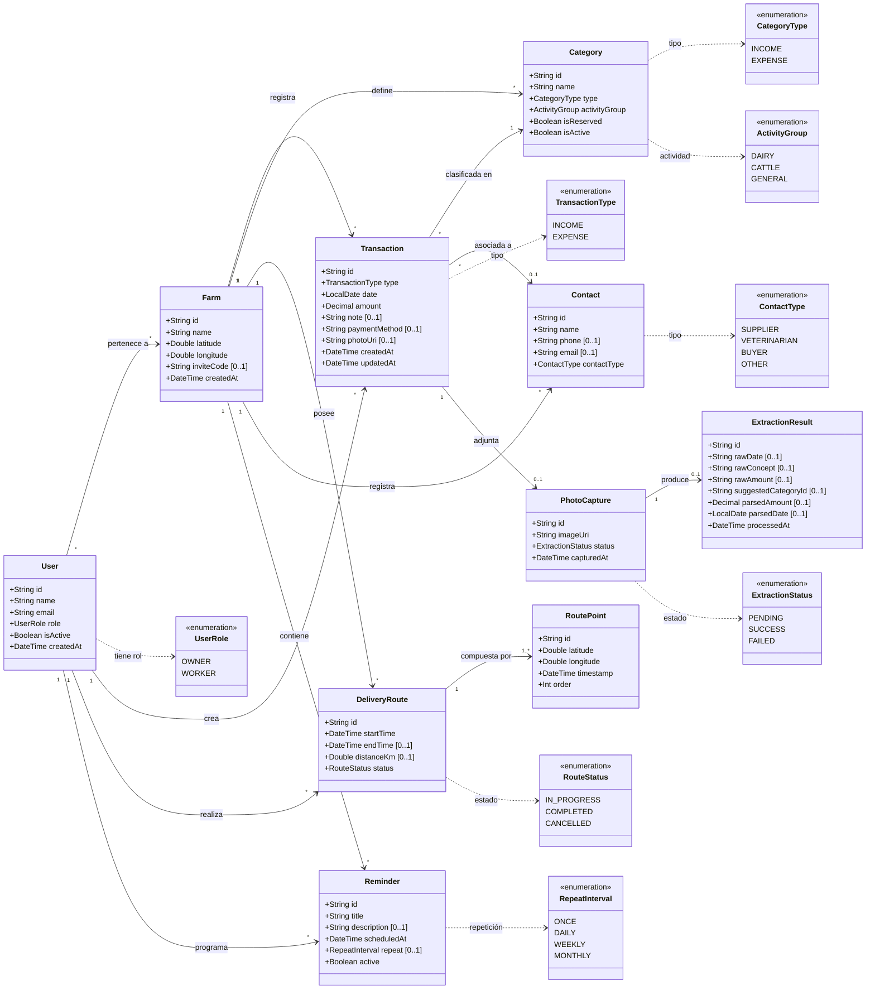

### Sistema de Gestión Económica — Finca Ganadera
*Versión 4 · 11 de agosto de 2026 — Farm como contexto directo de Transaction; relación User–Farm muchos-a-muchos; ajustes de relaciones y decisiones de modelado*

---

> **Alcance:** Este es un diagrama de clases de **análisis** (modelo de dominio / mundo del problema), no de diseño. Representa las entidades del negocio y sus relaciones. Las clases técnicas (repositorios, ViewModels, etc.) se definen en la arquitectura.

## Descripción de las clases

### Farm *(nueva)*
Entidad raíz que representa la finca ganadera. Todos los datos del sistema pertenecen a una finca. El propietario crea la finca al registrarse; los trabajadores se unen mediante un código de invitación.

| Atributo | Tipo | Obligatorio | Descripción |
|---|---|---|---|
| id | String (UUID) | Sí | Identificador único |
| name | String | Sí | Nombre de la finca (ej. "Finca La Esperanza") |
| latitude | Double | Sí | Latitud de la ubicación principal de la finca |
| longitude | Double | Sí | Longitud de la ubicación principal de la finca |
| inviteCode | String | No | Código activo para que trabajadores se unan (expira en 24h) |
| createdAt | DateTime | Sí | Fecha/hora de creación |

**Trazabilidad:** UC-13 (registro → crear finca), UC-14 (gestión de trabajadores → código de invitación)

### User
Usuario del sistema. Puede ser propietario (acceso completo) o trabajador (acceso operativo). Autenticación vía Firebase Auth.

| Atributo | Tipo | Obligatorio | Descripción |
|---|---|---|---|
| id | String (Firebase UID) | Sí | Identificador único (proviene de Firebase Auth) |
| name | String | Sí | Nombre del usuario |
| email | String | Sí | Email (usado como credencial de login) |
| role | UserRole | Sí | OWNER o WORKER |
| isActive | Boolean | Sí | `false` si el propietario desactivó al trabajador |
| createdAt | DateTime | Sí | Fecha/hora de creación |

**Trazabilidad:** UC-07 (login), UC-13 (registro), UC-14 (gestión)

### Transaction
Entidad central del módulo financiero. Representa un movimiento de dinero (ingreso o egreso) perteneciente directamente a una finca. El usuario que la registra se conserva como responsable de creación, pero la finca no se determina a través de la categoría.

| Atributo | Tipo | Obligatorio | Descripción |
|---|---|---|---|
| id | String (UUID) | Sí | Identificador único |
| type | TransactionType | Sí | INCOME o EXPENSE |
| date | LocalDate | Sí | Fecha del movimiento (predeterminada: hoy) |
| amount | Decimal | Sí | Monto en COP (siempre positivo) |
| note | String | No | Nota descriptiva libre |
| paymentMethod | String | No | Medio de pago (efectivo, transferencia, etc.) |
| photoUri | String | No | URI de foto adjunta (recibo, anotación) |
| createdAt | DateTime | Sí | Fecha/hora de creación del registro |
| updatedAt | DateTime | Sí | Fecha/hora de última modificación |

**Trazabilidad:** UC-01, UC-02, UC-06

### Category
Clasificación de las transacciones de una finca, agrupada por actividad económica. Las categorías no se crean libremente por los usuarios; vienen preconfiguradas. Las reservadas pueden activarse o desactivarse por el propietario.

| Atributo | Tipo | Obligatorio | Descripción |
|---|---|---|---|
| id | String (UUID) | Sí | Identificador único |
| name | String | Sí | Nombre de la categoría (ej. "Venta de leche") |
| type | CategoryType | Sí | INCOME o EXPENSE |
| activityGroup | ActivityGroup | Sí | Actividad económica: DAIRY, CATTLE o GENERAL |
| isReserved | Boolean | Sí | `true` si es una categoría reservada |
| isActive | Boolean | Sí | `true` si está disponible para registro |

**Trazabilidad:** UC-04, sección 8 del documento de requisitos

### ActivityGroup (enumeración)
Agrupa las categorías por línea de negocio.

| Valor | Descripción | Ejemplos de categorías |
|---|---|---|
| DAIRY | Lechería | Venta de leche, Venta de cuajada |
| CATTLE | Ganado | Venta de terneros, novillas, vacas, toros |
| GENERAL | Sin actividad específica | Egresos generales (salarios, servicios, impuestos, etc.) |

### DeliveryRoute *(nueva)*
Representa un recorrido de entrega de leche rastreado por GPS. El usuario inicia la ruta, el sistema registra puntos periódicamente, y al finalizar se calcula la distancia total.

| Atributo | Tipo | Obligatorio | Descripción |
|---|---|---|---|
| id | String (UUID) | Sí | Identificador único |
| startTime | DateTime | Sí | Fecha/hora de inicio del recorrido |
| endTime | DateTime | No | Fecha/hora de fin (null si está en progreso) |
| distanceKm | Double | No | Distancia total calculada al finalizar |
| status | RouteStatus | Sí | IN_PROGRESS, COMPLETED o CANCELLED |

**Trazabilidad:** UC-15, UC-16, UC-17

### RoutePoint *(nueva)*
Punto GPS individual capturado durante una ruta de entrega. La secuencia ordenada de puntos forma el trazado de la ruta sobre el mapa.

| Atributo | Tipo | Obligatorio | Descripción |
|---|---|---|---|
| id | String (UUID) | Sí | Identificador único |
| latitude | Double | Sí | Latitud |
| longitude | Double | Sí | Longitud |
| timestamp | DateTime | Sí | Momento exacto de la captura |
| order | Int | Sí | Orden secuencial dentro de la ruta |

**Trazabilidad:** UC-15, UC-16

### Contact *(nueva)*
Contacto relevante para la operación de la finca: proveedores, veterinarios, compradores. Puede importarse desde los contactos del dispositivo.

| Atributo | Tipo | Obligatorio | Descripción |
|---|---|---|---|
| id | String (UUID) | Sí | Identificador único |
| name | String | Sí | Nombre del contacto |
| phone | String | No | Teléfono |
| email | String | No | Correo electrónico |
| contactType | ContactType | Sí | SUPPLIER, VETERINARIAN, BUYER u OTHER |

**Trazabilidad:** UC-18

### Reminder *(nueva)*
Recordatorio programado que genera una notificación local (y opcionalmente push) en la fecha/hora indicada. Puede ser puntual o recurrente.

| Atributo | Tipo | Obligatorio | Descripción |
|---|---|---|---|
| id | String (UUID) | Sí | Identificador único |
| title | String | Sí | Título del recordatorio (ej. "Vacunación lote 3") |
| description | String | No | Descripción adicional |
| scheduledAt | DateTime | Sí | Fecha/hora de la notificación |
| repeat | RepeatInterval | No | ONCE, DAILY, WEEKLY o MONTHLY. Si es null, no se repite |
| active | Boolean | Sí | `true` si el recordatorio está programado |

**Trazabilidad:** UC-19

### PhotoCapture (Could)
Foto tomada de una anotación manuscrita. Solo aplica si se implementa el módulo de captura por IA.

| Atributo | Tipo | Obligatorio | Descripción |
|---|---|---|---|
| id | String (UUID) | Sí | Identificador único |
| imageUri | String | Sí | URI de la imagen capturada |
| status | ExtractionStatus | Sí | PENDING, SUCCESS o FAILED |
| capturedAt | DateTime | Sí | Fecha/hora de captura |

**Trazabilidad:** UC-09

### ExtractionResult (Could)
Resultado de la extracción de datos por IA a partir de una foto.

| Atributo | Tipo | Obligatorio | Descripción |
|---|---|---|---|
| id | String (UUID) | Sí | Identificador único |
| rawDate | String | No | Fecha tal como fue extraída (texto crudo) |
| rawConcept | String | No | Concepto tal como fue extraído |
| rawAmount | String | No | Monto tal como fue extraído |
| suggestedCategoryId | String | No | Categoría sugerida por el sistema |
| parsedAmount | Decimal | No | Monto parseado a número |
| parsedDate | LocalDate | No | Fecha parseada |
| processedAt | DateTime | Sí | Fecha/hora de procesamiento |

**Trazabilidad:** UC-10, UC-11

---

## Decisiones de modelado

1. **Farm como entidad raíz:** todos los datos operativos y financieros de una finca (transacciones, categorías, contactos, rutas y recordatorios) están asociados a una finca. Esto permite que varios usuarios compartan la información de la misma finca.

2. **User ↔ Farm es muchos-a-muchos:** un usuario puede pertenecer a una o varias fincas y una finca puede tener varios usuarios. La pertenencia determina el contexto en el que el usuario puede operar.

3. **User con rol en lugar de subclases:** se usa un discriminador `role` (OWNER/WORKER) en lugar de dos subclases. Ambos comparten los mismos atributos; la diferencia es de permisos, no de estructura.

4. **Transaction pertenece directamente a Farm:** la finca es la entidad propietaria/contexto de la transacción. `Category` solamente clasifica la transacción; no se utiliza para determinar a qué finca pertenece.

5. **User crea Transaction:** además de pertenecer a una finca, el usuario que registra una transacción queda asociado como creador. Esto permite distinguir entre el propietario de los datos y quién realizó el registro.

6. **Transaction no es abstracta:** se usa un solo tipo con discriminador `type` (INCOME/EXPENSE). Ambos comparten exactamente los mismos atributos.

7. **Category es fija, no creada libremente por el usuario:** las categorías se precargan con los datos de la sección 8 del documento de requisitos. El propietario solo puede activar/desactivar las reservadas dentro de su finca.

8. **DeliveryRoute → RoutePoint (composición):** una ruta se compone de una secuencia ordenada de puntos GPS. Si se elimina una ruta, se eliminan sus puntos. La multiplicidad `1..*` refleja que una ruta tiene al menos un punto.

9. **Contact pertenece a Farm, no a User:** los contactos son de la finca, no personales. Todos los usuarios de la finca ven el mismo directorio.

10. **Reminder pertenece a Farm y es programado por User:** el recordatorio queda dentro del contexto de una finca, mientras que el usuario indica quién lo creó/programó.

11. **PhotoCapture y ExtractionResult siguen siendo opcionales (Could):** no son necesarias para el MVP. Se implementan si el proyecto llega al módulo de IA.

12. **photoUri en Transaction:** permite adjuntar una foto directamente a una transacción (recibo, comprobante) sin pasar por el flujo de extracción IA. Cubre el uso de cámara/galería como requisito del curso.
