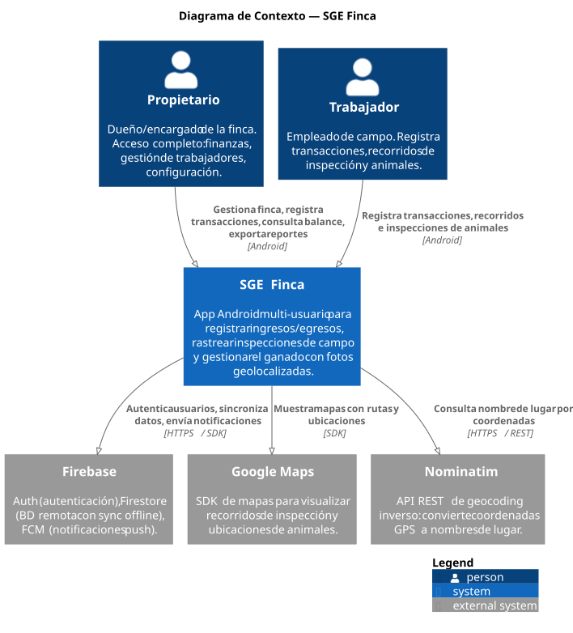
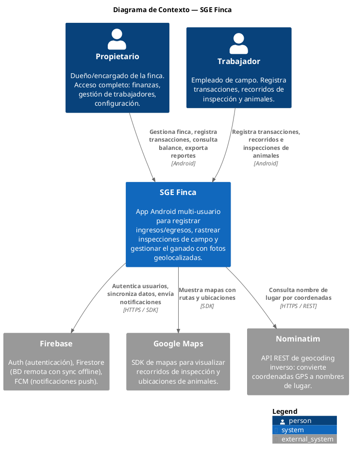
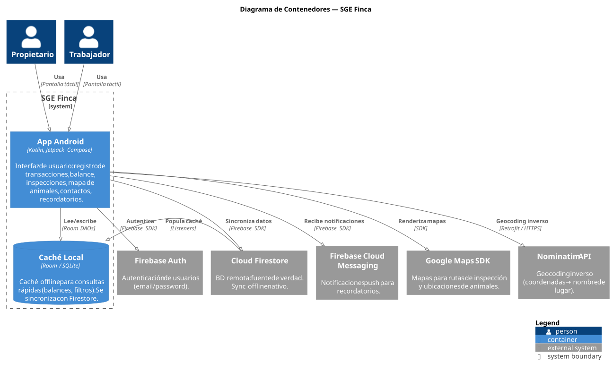
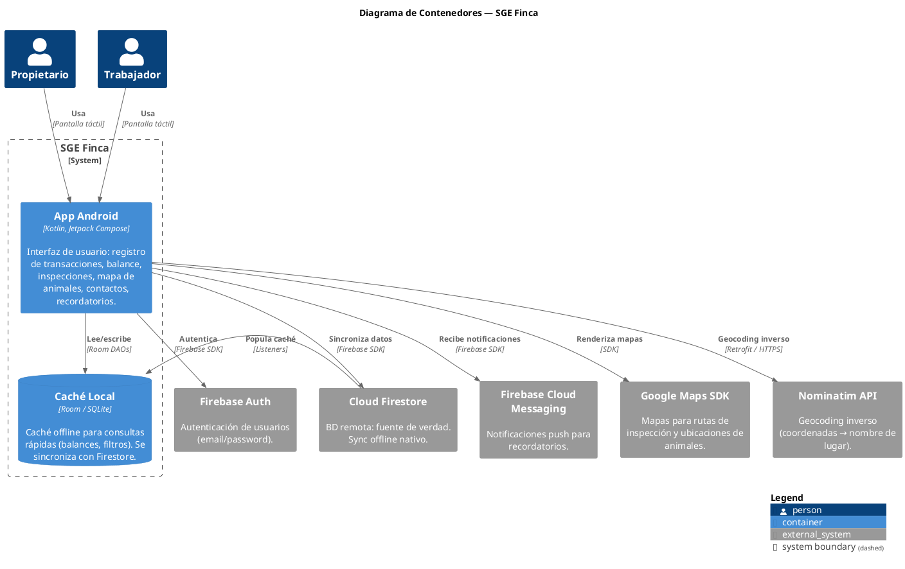
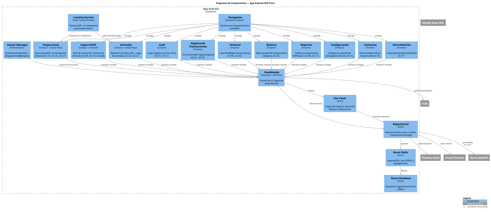
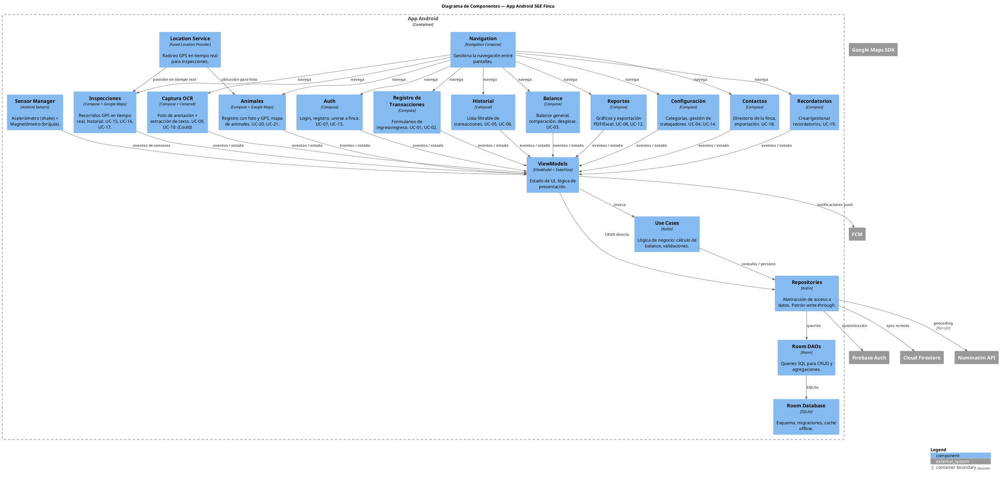

# Diagramas C4
### Sistema de Gestión Económica — Finca Ganadera
*Versión 3 · 17 de agosto de 2026 — Multi-usuario, Firebase, GPS, sensores, Nominatim*

---

## Nivel 1 — Contexto del Sistema

Muestra el sistema como caja negra, sus actores y los sistemas externos con los que interactúa.

Fuente PlantUML

### Notas
- Firebase cumple el requisito del curso de "backend de tercero para autenticación y almacenamiento".
- Nominatim cumple el requisito de "API REST externa" diferente a clima.
- Google Maps cumple el requisito de "GPS + mapas + seguimiento en tiempo real".
- Si se implementa el módulo OCR (Could), se usa ML Kit on-device — no requiere sistema externo adicional.

---

## Nivel 2 — Contenedores

Muestra las unidades desplegables del sistema y cómo se comunican.

Fuente PlantUML

### Notas
- Solo hay un artefacto desplegable: la **app Android** (APK). Room es un componente interno de la app.
- Firestore maneja la sincronización online/offline nativamente (ADR-002, ADR-003).
- Room sirve como caché estructurada para consultas SQL complejas (balances con agrupación, filtros combinados).

---

## Nivel 3 — Componentes

Muestra los módulos internos de la app Android y sus responsabilidades.

Fuente PlantUML

### Mapeo componentes → requisitos

| Componente | Casos de Uso | Requisitos |
|---|---|---|
| Auth + VM | UC-07, UC-13, UC-14 | RF-07, RF-13, RF-14, RNF-04, RNF-08 |
| Registro de Transacciones + VM | UC-01, UC-02 | RF-01, RF-02, RNF-01 |
| Balance + VM | UC-03 | RF-03, RNF-02 |
| Historial + VM | UC-05, UC-06 | RF-05, RF-06 |
| Configuración | UC-04, UC-14 | RF-04, RF-14 |
| Reportes + VM | UC-08, UC-12 | RF-08, RF-12 |
| Inspecciones + Google Maps | UC-15, UC-16, UC-17 | RF-15, RF-16, RF-17, RNF-10 |
| Animales + Google Maps | UC-20, UC-21 | RF-20, RF-21, RNF-10 |
| Contactos | UC-18 | RF-18 |
| Recordatorios + FCM | UC-19 | RF-19 |
| Captura OCR + CameraX | UC-09, UC-10, UC-11 | RF-09, RF-10, RF-11, RNF-03 |
| Room Database + DAOs | — (transversal) | RNF-06, RNF-07 |
| Repositories + Firestore | — (transversal) | RNF-07, RNF-08 |
| Location Service | — (transversal) | RNF-10 |
| Sensor Manager | — (transversal) | RNF-09 |

### Mapeo a requisitos del curso

| Requisito del curso | Componente que lo cumple |
|---|---|
| App móvil multi-usuario Android | Auth (Firebase Auth) + roles Propietario/Trabajador |
| Cámara | CameraX (Captura OCR + foto de animal) |
| Galería y almacenamiento | Selector de fotos + Firestore/Room |
| Contactos | Pantalla de Contactos (importación desde dispositivo) |
| 2 sensores ≠ luz ambiental | Acelerómetro (shake-to-register) + Magnetómetro (brújula en inspecciones) |
| GPS + mapas + seguimiento en tiempo real | Location Service + Google Maps SDK (Inspecciones + Animales) |
| Manejo de rutas | Inspecciones: inicio, tracking, historial de recorridos |
| Notificaciones | FCM (push) + notificaciones locales (Recordatorios) |
| Backend de tercero | Firebase (Auth + Firestore + FCM) |
| API REST externa ≠ clima | Nominatim (geocoding inverso) vía Retrofit |

---

> **Regenerar los SVG:** tras editar cualquier bloque PlantUML de este documento, ejecuta `scripts/render-diagrams.sh` y commitea los cambios de `assets/`. El CI falla si el SVG commiteado no corresponde a la fuente.
