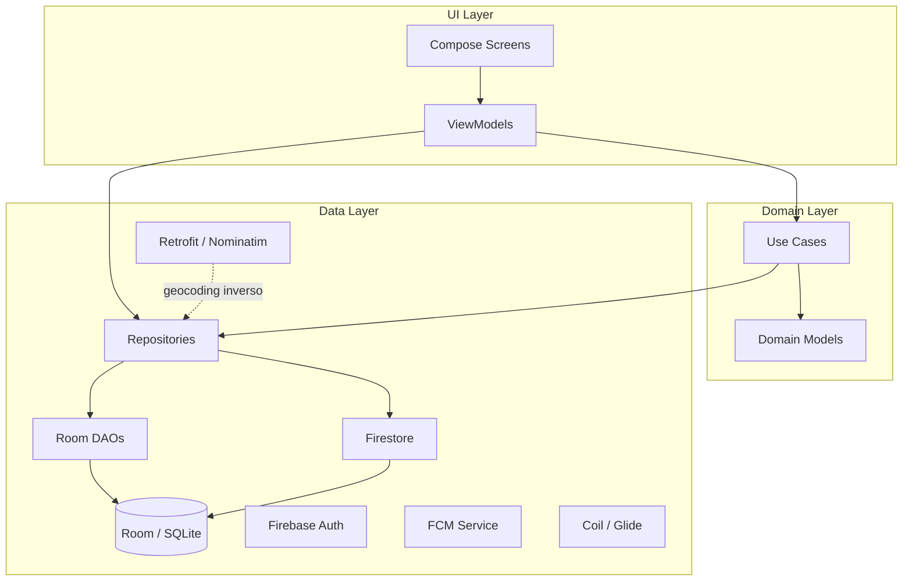

# Estilo Arquitectónico
### Sistema de Gestión Económica — Finca Ganadera
*Versión 2 · 17 de agosto de 2026 — Multi-usuario, Firebase, GPS, sensores*

---

## Decisión

**MVVM (Model-View-ViewModel)** con separación en capas inspirada en Clean Architecture, adaptada a la escala del proyecto (app multi-usuario con backend Firebase, equipo de 4 desarrolladores).

## Justificación

### ¿Por qué MVVM?

MVVM es el patrón recomendado oficialmente por Google para aplicaciones Android con Jetpack Compose. La razón es simple: Compose es declarativo y reactivo — los `@Composable` se re-renderizan cuando cambia el estado, y el ViewModel es el lugar natural para exponer ese estado de forma observable (vía `StateFlow`).

| Alternativa | Por qué no |
|---|---|
| MVC | No tiene separación clara en Android; el Activity/Fragment termina siendo Controller + View. Con Compose no aplica. |
| MVP | Requiere interfaces View/Presenter que añaden boilerplate sin aportar valor sobre MVVM + Compose. |
| MVI (Model-View-Intent) | Más riguroso que MVVM (estado único, reducers), pero sobredimensionado para una app con flujos simples de CRUD y consulta. |

### ¿Por qué "Clean Architecture ligera"?

Clean Architecture clásica (Robert C. Martin) propone 3-4 capas con inversión de dependencias estricta. Para un proyecto con ~12 entidades, 21 casos de uso y un equipo de 4 personas en un semestre, la versión completa introduce demasiada indirección (interfaces para todo, mappers entre capas, etc.).

Se adopta una versión **ligera** con 3 capas y reglas claras de dependencia, sin la capa de mappers intermedios ni abstracciones prematuras:

## Capas

```
┌─────────────────────────────────────────┐
│            UI (Presentation)            │
│  Compose Screens + ViewModels           │
│  Expone StateFlow, recibe eventos       │
├─────────────────────────────────────────┤
│            Domain (Lógica)              │
│  Use Cases (opcional) + Modelos         │
│  Reglas de negocio puras                │
├─────────────────────────────────────────┤
│            Data (Persistencia + Sync)   │
│  Room DAOs + Repositories              │
│  Firebase (Auth, Firestore, FCM)        │
│  Retrofit (Nominatim) + Coil/Glide     │
└─────────────────────────────────────────┘

Regla: UI → Domain → Data (nunca al revés)
```

### Capa UI (Presentation)
- **Compose Screens:** pantallas declarativas (`@Composable`). No contienen lógica de negocio.
- **ViewModels:** exponen el estado de la UI como `StateFlow<UiState>`. Reciben eventos del usuario, invocan la capa de dominio y actualizan el estado.
- **Navegación:** Jetpack Navigation Compose.

### Capa Domain (Lógica de negocio)
- **Modelos de dominio:** `Transaction`, `Category`, `User`, `Farm`, `InspectionRoute`, `AnimalRecord`, etc. Son clases Kotlin simples (data classes), sin anotaciones de Room ni Firestore.
- **Use Cases (opcionales):** solo se crean cuando la lógica es lo suficientemente compleja para justificar una clase propia. Ejemplo: `CalculateBalanceUseCase` (agrega por periodo y actividad). Para operaciones CRUD simples, el ViewModel puede invocar directamente al Repository.
- **Sin dependencia de Android:** esta capa es Kotlin puro, testeable sin emulador.

### Capa Data (Persistencia + Sincronización)
- **Room Entities:** clases anotadas con `@Entity` que mapean a tablas SQLite (caché local para consultas complejas y offline-first).
- **DAOs:** interfaces con `@Dao` que definen las queries SQL.
- **Repositories:** clases que abstraen el acceso a datos. Implementan el patrón write-through: escriben en Room y Firestore; leen de Room (populada por listeners de Firestore). Ver ADR-002.
- **Firebase Auth:** autenticación de usuarios (email/password).
- **Firestore:** base de datos remota, fuente de verdad. Sincronización offline nativa.
- **FCM Service:** recepción de notificaciones push para recordatorios.
- **Retrofit:** cliente HTTP para la API REST de Nominatim (geocoding inverso).
- **Coil/Glide:** carga y caché de imágenes (fotos de animales, recibos).

## Convención sobre indirección

Para mantener la simplicidad:

| Situación | Enfoque |
|---|---|
| CRUD simple (crear, leer, actualizar, eliminar transacción) | ViewModel → Repository → DAO + Firestore. Sin UseCase intermedio. |
| Lógica de negocio no trivial (calcular balance con desglose, validar reglas de categorías) | ViewModel → UseCase → Repository. |
| Mapeo entre Room Entity y modelo de dominio | Solo si los modelos divergen. Mientras sean iguales, se usa la misma clase (con anotaciones Room). Si divergen, se introduce un mapper puntual. |

## Diagrama de dependencias



## Stack tecnológico

| Categoría | Tecnología |
|---|---|
| Lenguaje | Kotlin |
| IDE | Android Studio |
| UI | Jetpack Compose + Material 3 |
| Arquitectura | MVVM + Navigation Compose + ViewModel |
| Mapas y GPS | Google Maps SDK + Fused Location Provider |
| Backend | Firebase Auth + Firestore + FCM |
| HTTP | Retrofit (API REST de Nominatim) |
| Imágenes | Coil o Glide |
| Cámara | CameraX |
| Sensores | Acelerómetro (shake-to-register) + Magnetómetro/Brújula (orientación en inspecciones) |
| Caché local | Room / SQLite |
| DI | Hilt (evaluable) |

## Trazabilidad

| Componente | Requisitos que satisface |
|---|---|
| MVVM + Compose | RNF-01 (UI simple), RNF-05 (Android nativo) |
| Room + Repository + Firestore | RNF-06 (sin pérdida de datos), RNF-07 (offline-first) |
| Firebase Auth | RNF-04 (seguridad), RNF-08 (multi-usuario) |
| FCM Service | RF-19 (notificaciones push) |
| Google Maps + Fused Location | RNF-10 (GPS), RF-15/16/17 (inspecciones), RF-20/21 (animales en mapa) |
| CameraX | RF-09 (captura foto), RF-20 (foto de animal) |
| Retrofit + Nominatim | RF-20/21 (geocoding inverso) |
| Acelerómetro + Magnetómetro | RNF-09 (2 sensores ≠ luz ambiental) |
| Capa Domain pura Kotlin | Testabilidad, mantenibilidad |
